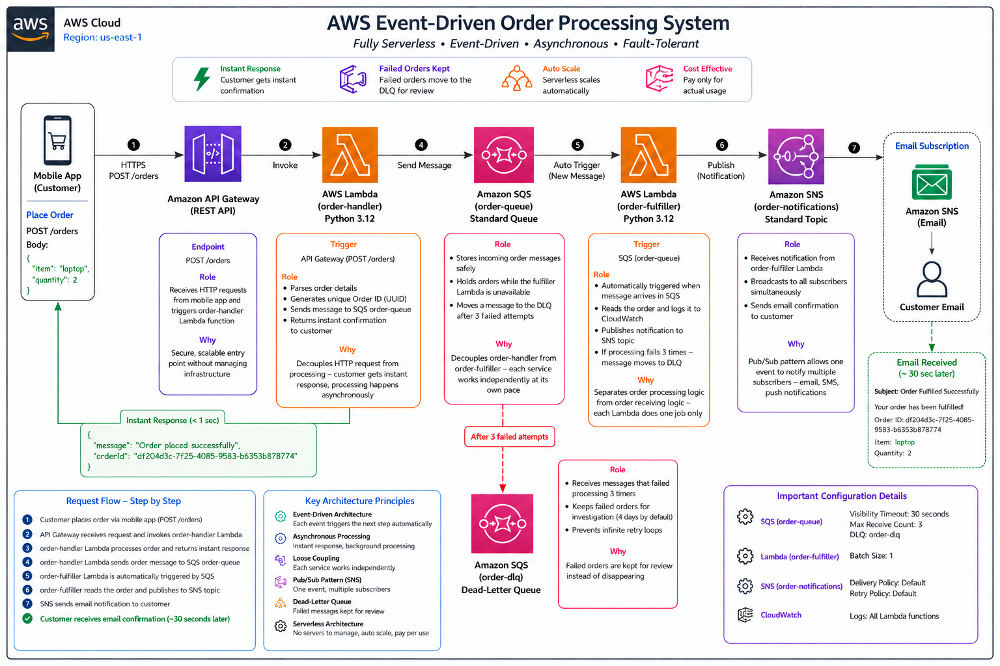

# AWS Event-Driven Order Processing System

I built this project to understand how AWS services can work together
without being directly connected to each other. Before this project,
I did not fully understand how large applications like Swiggy or Amazon
handle thousands of orders simultaneously without crashing. Building
this taught me exactly how that works.

---

## Why I Built This

I kept seeing "event-driven architecture" mentioned in AWS job descriptions
but I did not really understand what it meant in practice. I wanted to build
something real that would help me explain it confidently in interviews.

The idea is simple — when a customer places an order:
- They should get an instant response, not wait for the order to be processed
- If something goes wrong during processing, the order should not disappear
- The system should handle many orders at the same time without breaking

I used AWS serverless services to solve all three of these problems.

---

## What I Built

An order processing system where:

1. Customer sends an order via API
2. System instantly confirms the order
3. Order gets processed in the background
4. Customer receives an email when order is fulfilled
5. If processing keeps failing, the order is moved to a Dead-Letter Queue instead of disappearing

---

## Architecture



The diagram above shows the complete flow from the mobile app through
API Gateway, Lambda, SQS, SNS and the Dead-Letter Queue, along with
the main settings I used in this project.

---

## AWS Services I Configured

### Amazon API Gateway
I created a REST API called `order-api` with a single POST /orders endpoint.
This is the URL the mobile app calls to place an order.
I deployed it to a stage called `dev`.

The main thing I learned here is that API Gateway does not run any code itself —
it just receives the request and passes it to Lambda.

### AWS Lambda — order-handler
Runtime: Python 3.12

This function receives the order from API Gateway, generates a unique Order ID
using UUID and sends the order as a message to the SQS queue.
It then immediately returns a confirmation to the customer.

I attached `AmazonSQSFullAccess` policy to this Lambda's execution role
so it has permission to write messages to the SQS queue.

One thing that confused me initially — I was wondering why SQS is not
configured as a trigger for this Lambda. Then I understood: this Lambda
SENDS messages to SQS, it does not RECEIVE from it. The trigger here
is API Gateway, not SQS.

### Amazon SQS — order-queue (Main Queue)
Type: Standard Queue

Visibility Timeout: 30 seconds

Maximum Receives before DLQ: 3

This queue sits between the two Lambda functions and holds order messages
safely until the fulfiller Lambda processes them.

I had to create the Dead-Letter Queue FIRST before creating this queue
because this queue needs to reference the DLQ during setup.
That order matters and I learned it the hard way.

### AWS Lambda — order-fulfiller
Runtime: Python 3.12

Trigger: Amazon SQS (order-queue)

Batch Size: 1

This function automatically runs whenever a new message arrives in the queue.
It reads the order, logs it to CloudWatch and publishes a notification to SNS.
There is no real processing step (like checking stock or taking payment) in this project.

I attached both `AmazonSQSFullAccess` and `AmazonSNSFullAccess` to this
Lambda's execution role.

Unlike the first Lambda which is triggered by API Gateway, this one is
triggered directly by SQS. This is the core of what makes the system
event-driven — the function reacts automatically to events in the queue.

### Amazon SQS — order-dlq (Dead-Letter Queue)
Type: Standard Queue

This queue captures messages that failed processing 3 times (Maximum Receives = 3, so the first try plus 2 retries).

I tested this on purpose. I added one line to order-fulfiller that makes
it fail on every order, deployed it, and sent a test order with
`"item": "dlq-test"`. About 2 minutes later I polled order-dlq in the SQS
console and found that exact message sitting there:

```
{"orderId": "8084afa3-03e3-4f4b-8b32-39d67cd72ab0", "item": "dlq-test", "quantity": 1}
```

Then I removed the line, deployed again, and sent a normal order to
confirm the email arrived like before.

Seeing the failed order land in the DLQ was actually one of the most
interesting parts of the project because it showed me concretely what
happens to failed messages in a real system.

### Amazon SNS — order-notifications
Type: Standard Topic

Subscription: Email

Once an order is fulfilled, the Lambda publishes a notification here
and SNS sends an email to everyone subscribed to the topic. For this
project that's just my own email. A real app would send each customer
their own email using something like SES.

I subscribed my own email address and confirmed the subscription by
clicking the confirmation link AWS sent. I verified the subscription
status showed a proper Subscription ID on the SNS console.

---

## Real Test Results

I tested using the API Gateway built-in test tool with this request:

```json
{
    "item": "laptop",
    "quantity": 2
}
```

Response I received (under 1 second):
```json
{
    "statusCode": 200,
    "body": "{\"message\": \"Order placed successfully\", \"orderId\": \"df204d3c-7f25-4085-9583-b6353b878774\"}"
}
```

The response comes back wrapped in `statusCode` and `body` because the POST
method uses a plain Lambda integration, not Lambda proxy integration.

About 30 seconds later I received this email:

```
Subject: Order Fulfilled Successfully
Your order has been fulfilled! Order ID: df204d3c-7f25-4085-9583-b6353b878774, Item: laptop, Quantity: 2
```

| Test | Result |
|---|---|
| API returns Status 200 | ✅ Passed — 937ms response time |
| Unique Order ID generated | ✅ Passed |
| SQS receives message | ✅ Passed |
| order-fulfiller triggered automatically | ✅ Passed |
| Email notification received | ✅ Passed |
| Failed message moves to DLQ after 3 failed attempts | ✅ Passed — test order found in order-dlq |

---

## AWS Configuration Details

| Service | Setting | Value |
|---|---|---|
| SQS order-queue | Visibility Timeout | 30 seconds |
| SQS order-queue | Maximum Receives | 3 |
| SQS order-queue | Dead-Letter Queue | order-dlq |
| Lambda order-fulfiller | Batch Size | 1 |
| Lambda order-fulfiller | Trigger | SQS order-queue |
| API Gateway | Stage | dev |
| API Gateway | Method | POST /orders |
| SNS | Protocol | Email |

---

## What I Learned

Before this project, event-driven architecture was just a concept to me. Building this made me understand how it actually works in real life.

Every time we place an order on Swiggy or Zomato ,the app confirms it without waiting for the restaurant to respond. That instant confirmation is possible because the two sides are not directly connected — there is a queue sitting between them. The app drops the order and moves on. The restaurant picks it up when it is ready. If the restaurant system is slow ,our order is still safe. The app never even knows there was a delay.

That is exactly what I built. The first Lambda takes the order and puts it in the SQS queue. The second Lambda picks it up and sends the notification. They never talk to each other directly. If the second Lambda goes down the message waits in the queue and retries automatically. If it keeps failing it moves to the Dead Letter Queue, where it is kept for investigation instead of disappearing (until the DLQ's retention period ends, 4 days by default).

Now I understand why the biggest platforms in the world use queues — not because it is more complex but because it is the only way to build something that does not break when one part has a problem.

---

## Project Structure

```
aws-event-driven-order-system/
├── lambdas/
│   ├── order_handler.py       # Lambda 1 — receives order, sends to SQS
│   └── order_fulfiller.py     # Lambda 2 — reads order, notifies via SNS
├── architecture.png           # Architecture diagram with AWS icons
└── README.md                  # This file
```

---

## How to Deploy This

### Step 1 — Create Dead-Letter Queue first
```
Service   : Amazon SQS
Name      : order-dlq
Type      : Standard Queue
```

### Step 2 — Create Main Queue
```
Service           : Amazon SQS
Name              : order-queue
Type              : Standard Queue
Dead-Letter Queue : order-dlq
Maximum Receives  : 3
```

Note: Create the DLQ first. The main queue setup asks you to select
a DLQ during configuration — it must already exist.

### Step 3 — Create SNS Topic and confirm subscription
```
Service      : Amazon SNS
Name         : order-notifications
Type         : Standard
Subscription : Email
```

Important: After creating the subscription, immediately check your inbox
and click the confirmation link. Also verify the Subscription ID shows
a proper ID and not "Deleted" on the SNS console.

### Step 4 — Create order-handler Lambda
```
Service    : AWS Lambda
Name       : order-handler
Runtime    : Python 3.12
Code       : lambdas/order_handler.py
```
After creating: Go to Configuration → Permissions → click the role name
→ Attach AmazonSQSFullAccess policy

Then go to Configuration → Environment variables and add `QUEUE_URL` = the URL of your order-queue

### Step 5 — Create order-fulfiller Lambda
```
Service    : AWS Lambda
Name       : order-fulfiller
Runtime    : Python 3.12
Code       : lambdas/order_fulfiller.py
```
After creating:
- Attach AmazonSQSFullAccess and AmazonSNSFullAccess to the role
- Add trigger: SQS → order-queue → Batch size 1
- Add environment variable: `SNS_TOPIC_ARN` = the ARN of your order-notifications topic

### Step 6 — Create API Gateway
```
Service   : Amazon API Gateway
Name      : order-api
Type      : REST API
Resource  : /orders
Method    : POST → Lambda → order-handler
Stage     : dev
```

---

## Monitoring

I checked Lambda execution using the Monitor tab on each function.
CloudWatch logs showed:

```
Processing order: df204d3c-7f25-4085-9583-b6353b878774
Item: laptop, Quantity: 2
Notification sent for order: df204d3c-7f25-4085-9583-b6353b878774
```

The Monitor tab also showed Invocations count and Error count which
helped me confirm when functions were being triggered and when they
were failing.

---

## Known Gaps

Both Lambda functions have their own separate execution roles, which is good. But the policies I attached are too broad. I used `AmazonSQSFullAccess` on order-handler, and `AmazonSQSFullAccess` plus `AmazonSNSFullAccess` on order-fulfiller. These allow actions on every queue and every topic in my account, not just the ones this project uses.

Least privilege would look like this:
- order-handler: only `sqs:SendMessage` on order-queue
- order-fulfiller: only `sqs:ReceiveMessage`, `sqs:DeleteMessage` and `sqs:GetQueueAttributes` on order-queue, plus `sns:Publish` on the order-notifications topic

I haven't changed this yet. It's the next thing I want to fix.

---

## References

- [AWS Event-Driven Architecture Workshop](https://catalog.workshops.aws/building-event-driven-architectures-on-aws/en-US)
- [Amazon SQS Documentation](https://docs.aws.amazon.com/sqs)
- [Amazon SNS Documentation](https://docs.aws.amazon.com/sns)
- [AWS Lambda Documentation](https://docs.aws.amazon.com/lambda)
- [Amazon API Gateway Documentation](https://docs.aws.amazon.com/apigateway)

---

## Author

**Muralidharan M N**

AWS Certified Cloud Practitioner | AWS re/Start Graduate

LinkedIn: https://www.linkedin.com/in/muralidharan-m-n-78a2522b8

GitHub: https://github.com/muralidharan666666-dev
