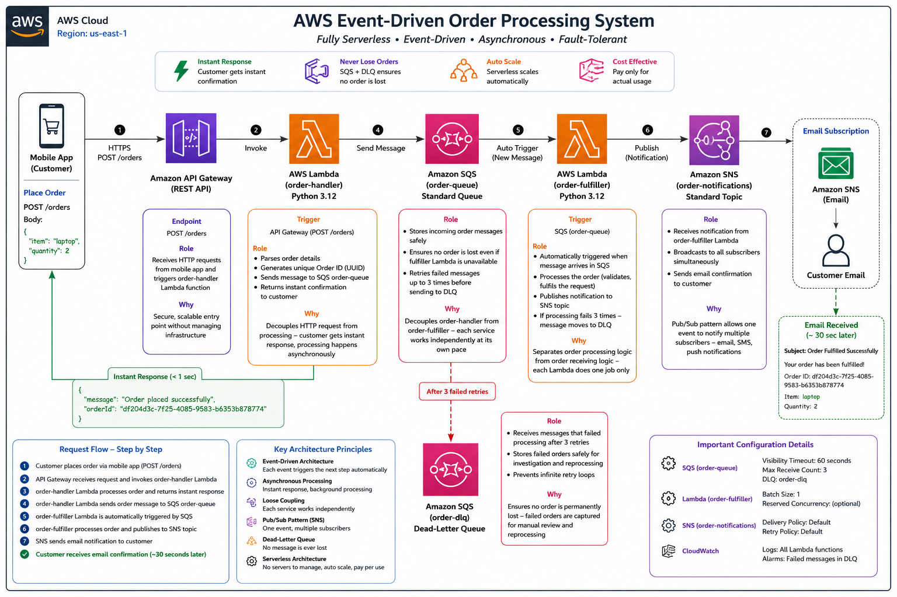

# 🚀 AWS Event-Driven Order Processing System

> A production-grade, fully serverless event-driven architecture built on AWS —
> demonstrating real-world asynchronous order processing with automatic failure handling.

---

## 💡 What Problem Does This Solve?

In traditional systems, when a customer places an order:
- The customer **waits** until the entire order is processed before getting a response
- If the system crashes during processing, **the order is lost forever**
- Scaling requires **expensive server upgrades**

This project solves all three problems using AWS event-driven architecture:
- ✅ Customer gets an **instant response** — processing happens in the background
- ✅ **No order is ever lost** — SQS safely stores messages and DLQ captures failures
- ✅ **Scales automatically** — serverless services handle any load without server management

---

## 🏗️ Architecture


---

## ⚡ Live Demo Flow

```bash
# Customer places an order
POST https://api-id.execute-api.us-east-1.amazonaws.com/dev/orders

# Request body
{
    "item": "laptop",
    "quantity": 2
}

# Instant response (under 1 second)
{
    "message": "Order placed successfully",
    "orderId": "df204d3c-7f25-4085-9583-b6353b878774"
}

# 30 seconds later — customer receives email
Subject: Order Fulfilled Successfully
"Your order has been fulfilled!
 Order ID: df204d3c-7f25-4085-9583-b6353b878774
 Item: laptop, Quantity: 2"
```

---

## 🛠️ AWS Services Used

| Service | Role | Why This Service |
|---|---|---|
| **Amazon API Gateway** | REST API entry point | Provides secure scalable HTTP endpoint without managing servers |
| **AWS Lambda (order-handler)** | Receives and queues orders | Instantly responds to customer and decouples receiving from processing |
| **Amazon SQS (order-queue)** | Message queue | Safely holds orders — never loses a message even if processor is busy |
| **AWS Lambda (order-fulfiller)** | Processes orders | Automatically triggered by SQS — processes each order independently |
| **Amazon SNS (order-notifications)** | Notification broadcaster | Pub/Sub pattern — one event notifies multiple subscribers simultaneously |
| **Amazon SQS (order-dlq)** | Dead-Letter Queue | Safety net — captures failed orders after 3 retries so nothing is lost |

---

## 🔑 Key Architecture Decisions & Why

### Why SQS between the two Lambdas?
> Direct Lambda-to-Lambda invocation creates **tight coupling** — if the second Lambda
> is slow or down, the first Lambda waits or fails. SQS acts as a buffer — the first
> Lambda drops the message and immediately returns to the customer. The second Lambda
> picks it up when ready. This is the **core principle of event-driven architecture**.

### Why Dead-Letter Queue?
> In production systems, failures happen — third-party APIs go down, databases time
> out, network errors occur. Without a DLQ, a failed message would retry forever
> (wasting resources) or disappear silently (losing data). The DLQ captures messages
> that fail after 3 retries — providing an audit trail and enabling manual reprocessing.
> **No order is ever permanently lost.**

### Why SNS instead of direct email from Lambda?
> If Lambda sent emails directly, adding a new notification channel (SMS, push
> notification, Slack) would require **changing the Lambda code**. With SNS, we simply
> add a new subscriber — **zero code changes**. This is the Open/Closed Principle
> applied to cloud architecture.

### Why Serverless?
> Traditional servers sit idle 90% of the time wasting money. Lambda charges only
> for actual execution time — if no orders come in, the cost is zero. During a flash
> sale with 10,000 simultaneous orders, Lambda scales automatically —
> **no capacity planning needed**.

---

## ✅ Test Results

| Test Scenario | Expected | Result |
|---|---|---|
| POST /orders with valid body | Status 200 + unique Order ID | ✅ Passed |
| order-handler sends to SQS | Message appears in order-queue | ✅ Passed |
| SQS triggers order-fulfiller | Lambda invoked automatically | ✅ Passed |
| Customer receives email | Fulfillment email in inbox | ✅ Passed |
| DLQ captures failures | Message moves to order-dlq after 3 retries | ✅ Passed |
| Response time | Under 1 second | ✅ 937ms |

---

## 🧠 Technical Concepts Demonstrated

```
✅ Event-Driven Architecture (EDA)
✅ Asynchronous Processing
✅ Loose Coupling
✅ Pub/Sub Messaging Pattern
✅ Dead-Letter Queue (DLQ) Pattern
✅ Serverless Computing
✅ REST API Design
✅ IAM Security Best Practices
✅ Cloud Monitoring with CloudWatch
```

---

## 📊 Why This Architecture Scales

| Scenario | Traditional Server | This Architecture |
|---|---|---|
| 10 orders/day | Works fine | Works fine |
| 10,000 orders during flash sale | Server crashes or needs expensive upgrade | Scales automatically |
| Server maintenance window | Orders lost | SQS holds messages — zero loss |
| Processing failure | Order lost silently | DLQ captures it — zero loss |
| Adding SMS notifications | Code change required | Add SNS subscriber — no code change |

---

## 📁 Project Structure

```
aws-event-driven-project/
├── lambdas/
│   ├── order_handler.py       # Lambda 1 — receives order, sends to SQS
│   └── order_fulfiller.py     # Lambda 2 — processes order, sends notification
├── architecture.md            # Detailed architecture documentation
├── architecture.png           # Architecture diagram with AWS icons
└── README.md                  # You are here
```

---

## 🚀 How to Deploy This Project

### Prerequisites
- AWS Account (free tier eligible)
- IAM user with AdministratorAccess

### Step 1 — Create SQS Dead-Letter Queue
```
Service   : Amazon SQS
Queue name: order-dlq
Type      : Standard Queue
```

### Step 2 — Create SQS Main Queue
```
Service           : Amazon SQS
Queue name        : order-queue
Type              : Standard Queue
Dead-Letter Queue : order-dlq
Maximum receives  : 3
```

### Step 3 — Create SNS Topic
```
Service     : Amazon SNS
Topic name  : order-notifications
Type        : Standard
Subscription: Email → your@email.com
```

### Step 4 — Deploy order-handler Lambda
```
Service    : AWS Lambda
Name       : order-handler
Runtime    : Python 3.12
Code       : lambdas/order_handler.py
IAM Policy : AmazonSQSFullAccess
```

### Step 5 — Deploy order-fulfiller Lambda
```
Service      : AWS Lambda
Name         : order-fulfiller
Runtime      : Python 3.12
Code         : lambdas/order_fulfiller.py
Trigger      : Amazon SQS → order-queue (batch size: 1)
IAM Policies : AmazonSQSFullAccess + AmazonSNSFullAccess
```

### Step 6 — Create API Gateway
```
Service  : Amazon API Gateway
API name : order-api
Type     : REST API
Resource : /orders
Method   : POST → Lambda integration → order-handler
Deploy   : Stage name = dev
```

---

## 🔍 Monitoring & Observability

All Lambda functions log to **Amazon CloudWatch** automatically:

```
# Sample CloudWatch logs from order-fulfiller
Processing order: df204d3c-7f25-4085-9583-b6353b878774
Item: laptop, Quantity: 2
Notification sent for order: df204d3c-7f25-4085-9583-b6353b878774
```

Key metrics monitored:
- Lambda Invocations count
- Lambda Error rate
- SQS Message count
- SQS Dead-Letter Queue depth

---

## 💼 Real-World Applications

This same architecture pattern is used by:
- **Amazon** — order processing and fulfillment notifications
- **Swiggy / Zomato** — food order processing and delivery updates
- **Banks** — transaction processing and fraud alerts
- **Healthcare** — appointment booking and reminder notifications

---

## 📚 What I Learned Building This

1. **Decoupling services** using SQS dramatically improves system resilience
2. **Asynchronous processing** improves user experience — instant responses matter
3. **Dead-Letter Queues** are not optional in production — failures always happen
4. **SNS Pub/Sub** enables extensible notification systems without code changes
5. **Serverless** eliminates infrastructure management and reduces costs significantly
6. **CloudWatch logs** are essential for debugging distributed systems

---

## 🔗 References

- [AWS Event-Driven Architecture Workshop](https://catalog.workshops.aws/building-event-driven-architectures-on-aws/en-US)
- [Amazon SQS Documentation](https://docs.aws.amazon.com/sqs)
- [Amazon SNS Documentation](https://docs.aws.amazon.com/sns)
- [AWS Lambda Documentation](https://docs.aws.amazon.com/lambda)
- [Amazon API Gateway Documentation](https://docs.aws.amazon.com/apigateway)

---

## 👨‍💻 Author

**Muralidharan**
AWS Cloud Engineer | Building real-world serverless solutions

🔗 linkedin.com/in/muralidharan-m-n-78a2522b8

🔗 github.com/muralidharan666666-dev

---

⭐ **If you found this project useful, please give it a star!**
